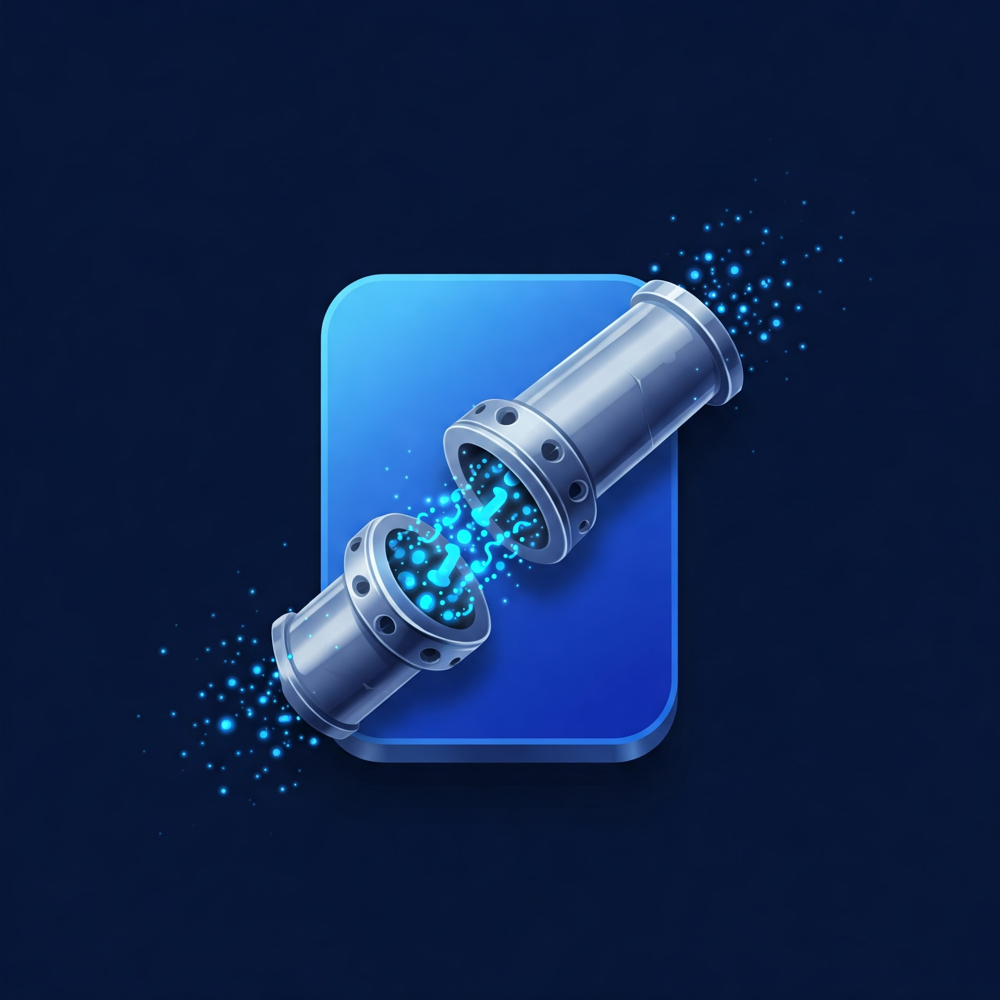

  

<h1 align="center">🚀 PushPipe</h1>

  <strong>Centralize as notificações do GitHub nos canais onde seu time realmente trabalha.</strong> 
  Discord, Slack e além — PushPipe conecta tudo.

---

## 💡 Sobre o PushPipe

**PushPipe é a ponte entre GitHub e os meios de comunicação da sua equipe**, começando com Discord — e com visão clara para integrar Slack, Microsoft Teams e outros.

Com ele, notificações importantes chegam onde sua equipe já está, promovendo sincronia, agilidade e colaboração, em tempo real.

---

## ✨ Benefícios para o seu Workflow

### 🔄 Notificações em Tempo Real

Receba alertas instantâneos sobre eventos do GitHub: criação de branches, pull requests, merges, issues e mais.

### 👥 Menções Inteligentes

PushPipe identifica automaticamente os membros relevantes e faz menções diretas nos canais configurados — ideal para revisões e decisões rápidas.

### ⚙️ Alertas Personalizados

Você define **quais eventos** devem gerar notificações, **para onde** elas vão e **como** devem aparecer.

### 🔌 Pensado para Escalar

Discord hoje. Slack, Teams e outros em breve. A arquitetura do PushPipe é modular e preparada para múltiplas integrações.

### 🚀 Setup em Minutos

Nada de configurações complicadas. Em poucos cliques, sua equipe já começa a receber notificações do GitHub.

---

## 📈 Impacto no Negócio

- ⏱️ **30% mais agilidade em revisões**
- 🔄 **25% menos conflitos por falta de visibilidade**
- 🌐 **Melhor colaboração remota**
- 🔍 **Mais clareza sobre responsabilidades**
- 🧭 **Onboarding mais rápido para novos devs**

---

## 🧪 Comece agora

🚀 **Teste grátis por 14 dias** e veja como PushPipe pode transformar a comunicação do seu time de desenvolvimento.

---

## 🧾 Padrão de Commits

Mantenha seu repositório limpo, legível e rastreável com nosso padrão baseado em emojis:

| Tipo                     | Emoji                   |
| ------------------------ | ----------------------- |
| Commit inicial           | 🎉 `:tada:`             |
| Tag de versão            | 🔖 `:bookmark:`         |
| Novo recurso             | ✨ `:sparkles:`         |
| Lista de ideias (tasks)  | 🔜 `:soon:`             |
| Bugfix                   | 🐛 `:bug:`              |
| Documentação             | 📚 `:books:`            |
| Testes                   | 🧪 `:test_tube:`        |
| Adicionando um teste     | ✅ `:white_check_mark:` |
| Teste de aprovação       | ✔️ `:heavy_check_mark:` |
| Acessibilidade           | ♿ `:wheelchair:`       |
| Texto                    | 📝 `:pencil:`           |
| Package.json em JS       | 📦 `:package:`          |
| Em progresso             | 🚧 `:construction:`     |
| Arquivos de configuração | 🔧 `:wrench:`           |
| Removendo dependência    | ➖ `:heavy_minus_sign:` |
| Adicionando dependência  | ➕ `:heavy_plus_sign:`  |
| Revertendo mudanças      | 💥 `:boom:`             |
| Alterações de revisão    | 👌 `:ok_hand:`          |
| Refatoração              | ♻️ `:recycle:`          |
| Mover/Renomear arquivos  | 🚚 `:truck:`            |

---

## 🤝 Contribua

Sua contribuição é bem-vinda! A comunidade ajuda o PushPipe a crescer — com ideias, código e feedback.

---

## 📫 Contato

Tem dúvidas, sugestões ou quer conversar? Entre em contato via [Discord](https://discord.gg/Pn4zKMa4), Slack (em breve) ou [abra uma issue](https://discord.gg/3457hzpXXe).

---

> Feito com 💙 para devs que amam produtividade e comunicação eficiente.
